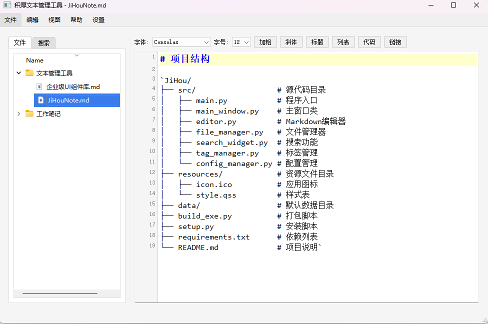

# JiHouNote - 积厚文本管理工具

JiHouNote是一款简洁高效的文本管理工具，专为知识积累和笔记管理而设计。支持Markdown格式，提供文件管理、搜索等功能，帮助您更好地组织和管理您的知识库。

## 主要功能

- **文件管理**：直观的文件树结构，轻松管理文档
- **Markdown支持**：内置Markdown编辑器，支持实时预览
- **搜索功能**：快速查找文档内容
- **自定义数据目录**：灵活设置数据存储位置
- **导入导出**：支持多种格式的文件导入导出

## 安装使用

1. 下载最新版本的JiHouNote.exe
2. 双击运行，无需安装
3. 默认数据保存在"我的文档/JiHou"目录下，可在设置中修改

## 快捷键

- `Ctrl+S`：保存当前文件

## 系统要求

- Windows 7/8/10/11
- 无需额外依赖

## 开发者信息

本项目使用Python和PyQt5开发。如需从源码构建：

1. 克隆仓库
2. 安装依赖：`pip install -r requirements.txt`
3. 运行：`python src/main.py`
4. 打包：`python build_exe.py`（Windows）或 `python build_mac.py`（Mac）

## 鸣谢

- **Trae AI**：提供技术支持和代码优化建议
- **Iconfont**：提供图标资源
- **PyQt5**：提供强大的GUI框架
- **Python**：提供编程语言支持
- **Markdown**：提供文档格式支持
- **PyInstaller**：提供应用打包支持
